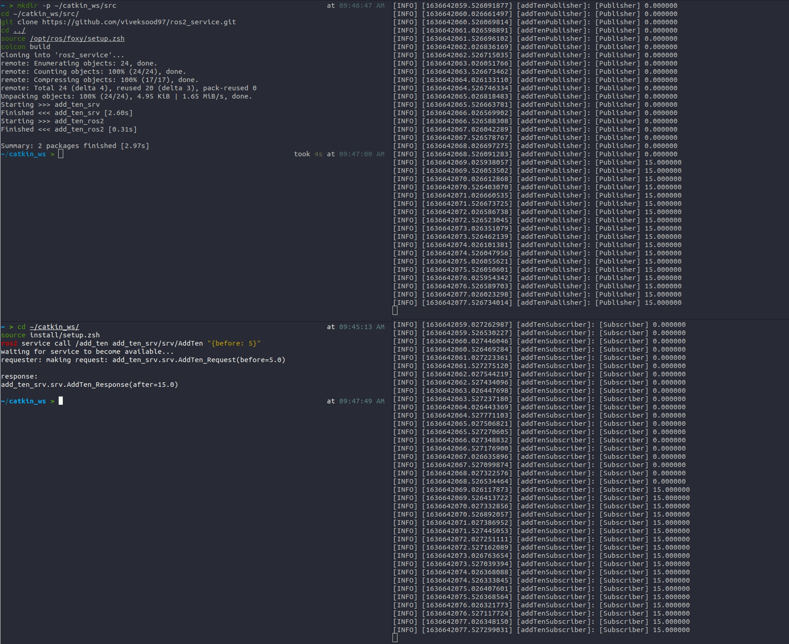

# ROS-2 Service Test
[](https://opensource.org/licenses/MIT)

# Overview
Wrote a service interface to modify published message in ROS-2

# Dependencies
- Ubuntu 20.04
- ROS foxy

## Building package via command-line
```
mkdir -p ~/colcon_ws/src
cd ~/colcon_ws/src/
git clone https://github.com/viveksood97/ros2_service.git
cd ../
source /opt/ros/foxy/setup.bash
colcon build
```
## Run
1. Start publisher node
```
cd ~/colcon_ws/
source install/setup.bash
ros2 run add_ten_ros2 publisher
```
2. Start Subscriber node
```
cd ~/colcon_ws/
source install/setup.bash
ros2 run add_ten_ros2 subscriber
```
3. To provide input use the service call.

```
cd ~/colcon_ws/
source install/setup.bash
ros2 service call /add_ten add_ten_srv/srv/AddTen "{before: 5}"
```
## Output
The terminal outputs of running pub, sub and changing the value is
